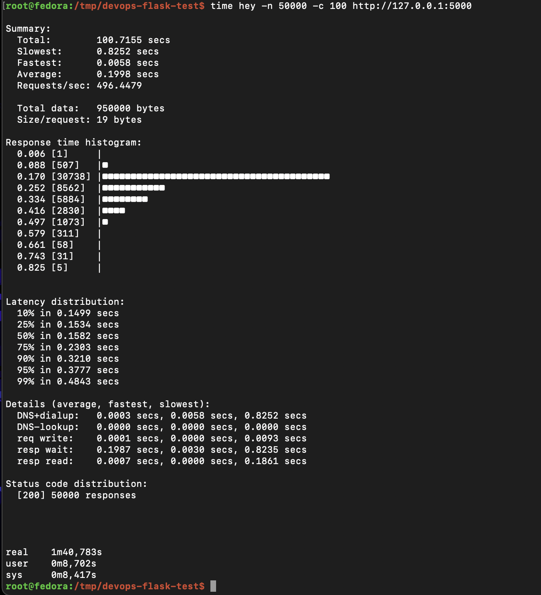
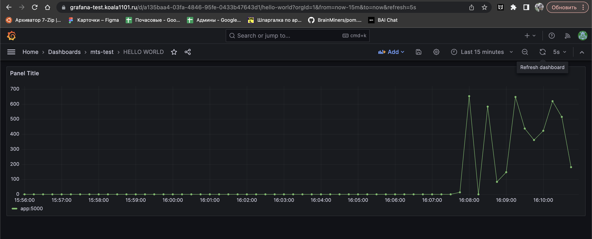

# Тестовое задание

В коде изменен запуск фласка - добавлено прослушивание всех хостов.

Приложение завернуто в Docker.
Для запуска `docker-compose up -d --build`

Grafana: https://grafana-test.koala1101.ru/d/a135baa4-03fa-4846-95fe-0433b47643d1/
user: mts-test
password: mts-test


---

### Проверка, что сервис держит >100 rps




---
```name=promql
sum(rate(hello_world_counter[30s])) by (instance)
```

